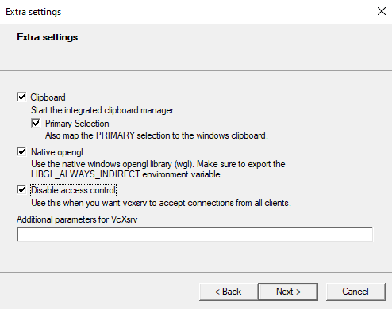

# [HALCYON](https://github.com/ryan-ern/Halcyon) 
Pada tugas besar Pemrograman Berorientasi Objek kami membuat sebuah game bernama Halcyon yang menggunakan bahasa pemrograman Python dengan _library_ pygame, Halcyon adalah game ber genre _Action_ dan _Shoot 'Em Up_.

Kami membuat game Halcyon ini karena terinspirasi dari video game Platypus yang menggunakan pesawat perang (player) untuk mengalahkan musuh-musuh di setiap levelnya. selain itu musuh juga memiliki kemampuan untuk menembak dan muncul secara _random_ dari kanan _window_ ke arah player (kiri). 

## How to run Docker
- Pertama clone repository ini atau Unduh dan ekstrak dengan cara [klik disini](https://github.com/rifan-frmsh/InvasiUFO/archive/refs/heads/main.zip) lalu pindahkan file tersebut ke disk `(D:)`
- Unduh vcxsrv dan install, fungsinya sebagai GUI untuk menjalankan game ini [klik disini](https://downloads.sourceforge.net/project/vcxsrv/vcxsrv/1.20.14.0/vcxsrv-64.1.20.14.0.installer.exe?ts=gAAAAABikM4htiS-mb2njw45IMlr5iPITdvV6w5QqC2tlvxcF5u9QUvHH742ZgREwNiP9q8K8-TvhIPFacna04QFFrmqVtzk7A%3D%3D&r=https%3A%2F%2Fsourceforge.net%2Fprojects%2Fvcxsrv%2Ffiles%2Flatest%2Fdownload)
- Jalankan Xlaunch dan next hingga muncul seperti digambar, kemudian next hingga finish
<div align="center"> 

</div>

- Berikutnya buka terminal dan pastikan directorynya berada pada lokasi folder `(D:)`
- Sebelum lanjut pastikan docker sudah aktif
- Pada terminal, jalankan syntax berikut untuk build docker
```
docker build -t halcyon .
```
- Untuk melihat apakah berhasil diubat images dockernya dengan cara
```
docker images
```
- Selanjutnya jalankan container dengan syntax berikut
```
docker run --privileged -it --rm --cap-add=SYS_PTRACE -u 0:0 -e DISPLAY=172.19.176.1:0.0 -v /d/halcyon-main:/home/apps halcyon /bin/bash
```
- Untuk `DISPLAY` sesuaikan dengan ip yang anda punya dengan cara:
  - Ketik `WIN+R` untuk membuka windows run, isikan dengan `CMD`
  - Didalam `CMD`, jalankan sintax `ipconfig`
  - Lalu salin `IPv4 Address` untuk mengubah `DISPLAY` 
- Untuk melihat file yang ada di dalam container, ketik `ls`, jika build sukses maka terlihat beberapa file dari program game ini
- Terakhir jalankan syntax berikut untuk memulai game
```
python main.py
```
## Demo container
[](https://youtu.be/3Sz1LUqCmW4)

Klik gambar diatas

## Depedencies (Library)
Adapun library yang kami gunakan dalam membuat game Halcyon, yaitu:
- **[Pygame](https://www.pygame.org)** merupakan library Python untuk membuat atau mengembangkan game.
- **[Random](https://docs.python.org/3/library/random.html)** merupakan library Python untuk pengacakan dalam menentukan suatu pilihan.
- **[Sys](https://docs.python.org/3/library/sys.html)** merupakan library Python untuk memanipulasi runtime Python.

## How to play
Sebelum memulai game, kita perlu [install bahasa Python](https://dqlab.id/cara-download-dan-install-python-pada-berbagai-sistem-operasi) dan [install library Pygame](https://www.nesabamedia.com/cara-instal-pygame-di-windows/) terlebih dahulu.

Berikut kontrol dalam game:
- Click the mouse for option `Button`
- Press `A` to move left
- Press `S` to move down
- Press `W` to move up
- Press `D` to move right
- Press `SPACE` or `UP` to fire

## UML
Untuk melihat Unified Modeling Language (UML) class diagram dari program kami **[Klik Disini](https://github.com/ryan-ern/Docker-Halcyon/blob/main/assets/UML.png)** 

## Development Contributor
- Abi Luthfi Ramdan Fadhillah - 120140151 ( **Project Leader and Programmer** )
- Dean Andhika Ramadhan       - 120140155 ( **Programmer and Sound Effect** )
- Ryan Ernanda                - 120140154 ( **Programmer and Sound Effect** )
- Martatia Amanda             - 120140163 ( **Programmer and Design** )
- Monica Adella Aisyah Renaldi- 120140144 ( **Programmer and Design** )
- M. Rafi Dzaki Akbar         - 120140094 ( **Programmer and Design** )
